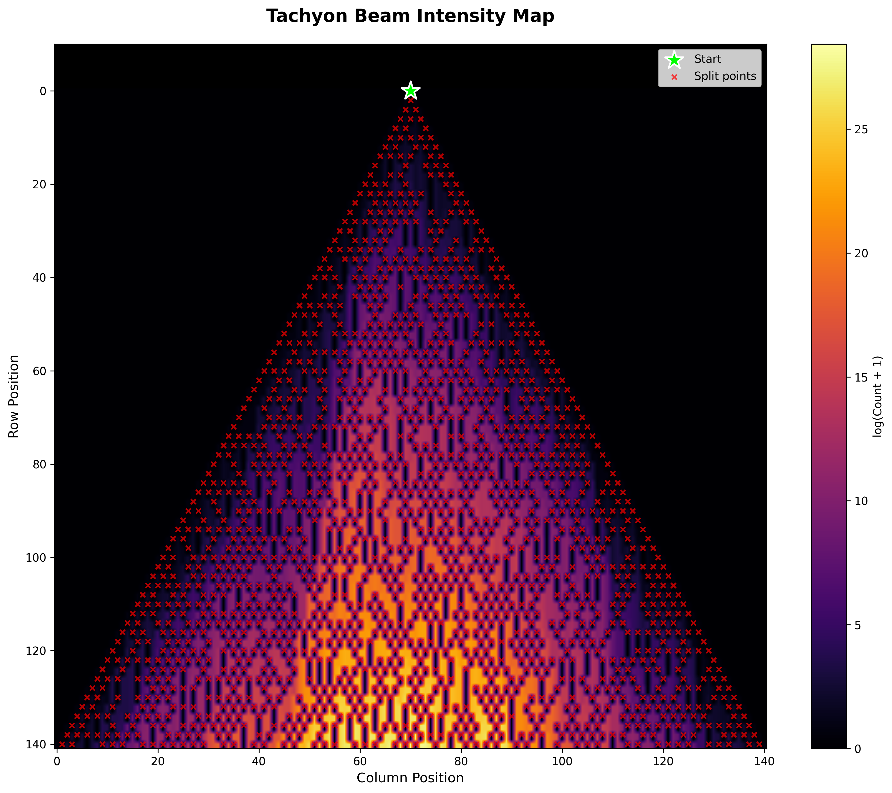

# Advent Of Code 2025

This repository contains my solutions for the [Advent of Code 2025](https://adventofcode.com/2025) challenge in **Python**.


*Day 7: Tachyon Beam Intensity Map - A visualization showing how a single beam creates over 13 trillion timelines through 1,579 splits. The end-result is a complex Christmas tree of possibilities.*

## Story Arc

This year, the Advent of Code story arc revolves around the Elves at the North Pole trying to prepare for Christmas. However, they are facing a crisis as they realize that they have a lot of work to do and not enough time to do it. You are tasked with helping the Elves solve various problems to ensure that Christmas can proceed as planned.

From the [Day 1 puzzle description](https://adventofcode.com/2025/day/1):

> The Elves have good news and bad news.

> The good news is that they've discovered project management! This has given them the tools they need to prevent their usual Christmas emergency. For example, they now know that the North Pole decorations need to be finished soon so that other critical tasks can start on time.

> The bad news is that they've realized they have a different emergency: according to their resource planning, none of them have any time left to decorate the North Pole!

> To save Christmas, the Elves need you to finish decorating the North Pole by December 12th.

## Files
- `inputs/`: Directory containing input files for each day (not included in the repository).
- `visualizations/`: Directory to store generated visualizations.
- `day[01-12].py`: Contains the solution for the respective day.
- `download.py`: Downloads the input for all days. For more instructions, keep reading.
- `run.sh`: Bash script to download the input and run the solution for all days.
- `requirements.txt`: List of required Python libraries.
- `README.md`: This file.

## Input Files

Input files are unique to each user and stored in the `inputs/` directory as `day[1-25].txt`. They are not included in this repository ([source](https://adventofcode.com/2025/about)).

To download inputs for all days:

```bash
python download.py
```

You'll need your Advent of Code session cookie in a `config.json` file:

```json
{
    "SESSION_TOKEN": "your_session_token"
}
```

Alternatively, download files manually from [Advent of Code](https://adventofcode.com/2025) and place them in the `inputs/` directory.

## Requirements

The requirements are very minimal, and you probably already have them installed.

The code is written in **Python 3**. Any recent version of Python 3 should work. The external libraries used are listed in the `requirements.txt` file and include `numpy`, `matplotlib`, `requests`, and `scipy`.

To install the required libraries, you can run:

```bash
pip install -r requirements.txt
```

## Run the Code

To run the code for all days, you can use the following command:

```bash
bash run.sh
```

This script will download the input and run the solution for all days. If you want to run the code for a specific day, you can run the following command:

```bash
python day01.py
```

This command will run the code for day 1. You can replace `day01.py` with any other day.

Some days include visualizations that can be generated with the `--visualize` or `-v` flag:

```bash
python day07.py --visualize
```

## Note

The solutions provided in this repository are my personal implementations and may not be the most efficient or optimal. This was a fun challenge for me to improve my problem-solving skills and use different algorithms and data structures. Feel free to use them as a reference or inspiration for your own solutions!
